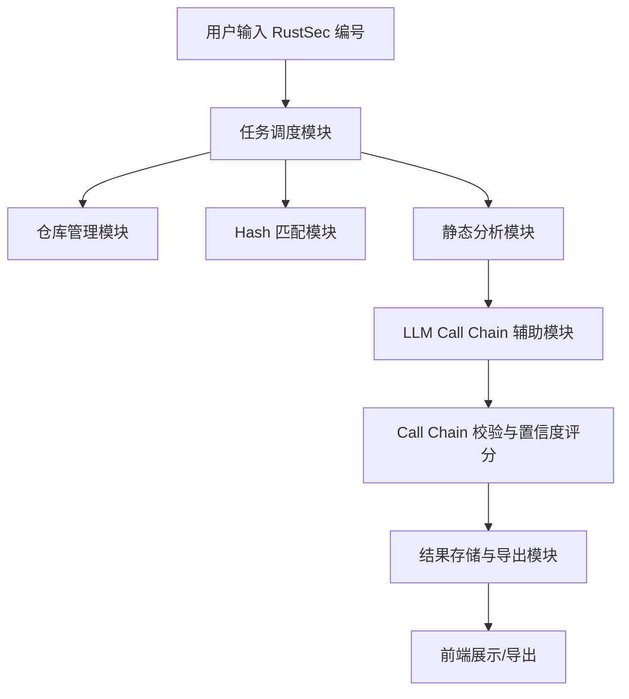

产品设计文档

产品名称

Siliver

1. 产品背景

随着 Rust 生态的安全漏洞数量激增，人工分析漏洞 call chain 的方式已无法满足高效、准确的需求。自动化、智能化的分析平台成为必然趋势。

---

2. 目标用户

- 安全研究员
- 开发者
- 安全自动化平台

---

3. 核心需求

- 批量输入 RustSec 编号，自动获取 commit hash、test hash
- 自动仓库管理（clone、checkout）
- 自动化 call chain 分析，并输出可视化结果
- 高准确率，防止 LLM 幻觉，确保结果可信
- 结果导出（extract the call chain of the from_object and show me the graph in txt of the call chain ）
- 高效并发处理

—


4. LLM 可信度与幻觉防控

4.1 LLM 可信度分析

- LLM 在代码理解、静态分析、call chain 生成方面有一定能力，但存在“幻觉”风险（即生成不真实或不准确的调用链）。
- 可信度受限于模型能力、上下文信息完整性、输入数据质量。

4.2 幻觉防控措施

-多模态校验：LLM 生成 call chain 后，必须用静态分析工具（如 rust-analyzer、cargo-call-stack）进行二次验证。
- 代码上下文补全：LLM 输入需包含完整的函数、调用关系、注释等上下文，减少模型误判。
- 人工 spot check：对部分结果抽样人工复核，持续优化 prompt 和流程。
- 结果置信度评分：为每条 call chain 生成置信度分数，低分结果自动标记为“需人工复核”。
- 多模型交叉验证：可用不同 LLM（如 GPT-4、Claude 3、Gemini 1.5）生成结果，取交集或加权。

4.3 推荐大模型

- 准确率优先：建议优先使用 GPT-4 Turbo（OpenAI）、Claude 3 Opus（Anthropic）、Gemini 1.5 Pro（Google）。
- 开源可控：如需本地部署，可考虑 Code Llama 70B、DeepSeek Coder，但准确率略低。
- 建议：主流程用 GPT-4 Turbo，静态分析为主，LLM 仅做补充和解释。

---

5. 功能列表

- RustSec 编号批量导入
- 自动仓库管理
- Commit/Test hash 自动匹配
- 静态分析+LLM 辅助生成 call chain
- 结果置信度评分与幻觉防控
- 结果展示与导出
- 错误处理与日志记录

---

6. 非功能性需求

- 支持多平台
- 高并发、可扩展
- 结果可追溯、可复查

---

工程设计文档
---

1. 系统架构



---

2. 模块划分与职责

2.1 任务调度模块

- 批量任务分发、并发控制、失败重试

2.2 仓库管理模块

- 自动 clone、pull、checkout
- 本地缓存、定期清理

2.3 Hash 匹配模块

- RustSec 数据解析，自动获取 commit/test hash

2.4 静态分析模块

- 用 rust-analyzer、cargo-call-stack 等工具，生成初步调用关系

2.5 LLM Call Chain 辅助模块

- 输入完整上下文，调用 GPT-4/Claude 3/Gemini 1.5 生成/补全 call chain
- 记录 LLM 置信度分数

2.6 Call Chain 校验与置信度评分

- 静态分析结果与 LLM 结果交叉验证
- 置信度低的结果自动标记
- 支持人工 spot check

2.7 结果存储与导出模块

- 支持 JSON/HTML 导出
- 结果可追溯、可复查

2.8 前端展示模块（可选）

- Web UI 或 CLI
- 支持结果浏览、筛选、导出

---

3. 技术选型

- **主语言**：Python（调度、自动化）、Rust（静态分析）
- **LLM API**：OpenAI GPT-4、Anthropic Claude 4、Google Gemini 2.5
- **静态分析工具**：rust-analyzer、cargo-call-stack
- **数据库**：SQLite 或本地文件
- **并发框架**：Python asyncio
- **前端**：Flask/Vue（可选）

---

4. 核心流程（伪代码）

```python
for rustsec_id in rustsec_list:
    repo_url, commit_hash, test_hash = resolve_hash(rustsec_id)
    repo_path = repo_manager.clone_and_checkout(repo_url, commit_hash)
    static_chain = static_analyzer.get_call_chain(repo_path, test_hash)
    llm_chain, llm_score = llm_helper.generate_call_chain(repo_path, test_hash, context=static_chain)
    final_chain, confidence = validator.cross_validate(static_chain, llm_chain, llm_score)
    exporter.save(final_chain, confidence)
```

---

## 5. 幻觉防控与准确率提升

- **静态分析为主，LLM 为辅**：主流程依赖 rust-analyzer 等工具，LLM 仅做补全和解释
- **多模型交叉验证**：可配置多种 LLM，结果取交集或加权
- **置信度评分**：每条 call chain 记录置信度，低分需人工复核
- **上下文补全**：LLM 输入需包含完整代码上下文
- **人工 spot check**：定期抽查，持续优化

---

## 6. 目录结构建议

```
project/
  - main.py
  - repo_manager.py
  - hash_resolver.py
  - static_analyzer.py
  - llm_helper.py
  - validator.py
  - exporter.py
  - config.py
  - requirements.txt
```

---

## 7. 未来扩展

- 支持更多漏洞数据库
- 集成 CI/CD
- 提供 API/Web 服务

---


原型和前端部分的设计

https://reactbits.dev/text-animations/circular-text
https://reactbits.dev/text-animations/curved-loop
https://8bitcn.com/r/8bit-button.json

后端代码实现

https://github.com/peiqing6888/silver.git

视频

Cursorful

chrome-extension://eihpmapodnppeemkhkbhikmggfojdkjd/record.html?tabId=1094170278

录制

关键突破点